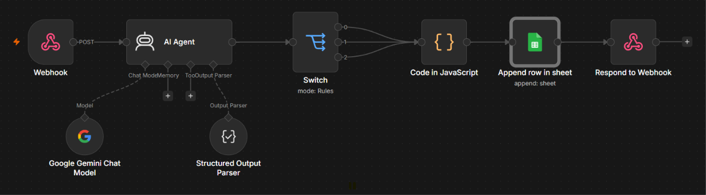

<div align="center">

# 💼 LeadFlow AI

### AI-Powered Lead Qualification & Sales Automation

*Automate your entire B2B lead pipeline in seconds — powered by Google Gemini, n8n, and modern web technologies.*

[](https://ai-lead-flow.vercel.app)
[](https://n8n-9xzh.onrender.com)
[](https://ai.google.dev)
[](https://n8n.io)

</div>

---

## 📖 What Is LeadFlow AI?

Every day, sales teams waste hours manually reading lead submissions, deciding if they're worth pursuing, writing personalized emails, and logging data into CRMs.

**LeadFlow AI eliminates all of that.**

Submit a lead → AI analyzes it → Score, priority, team assignment, and a personalized email are generated automatically → Everything is logged to a CRM database. All in a few seconds.

> **Example:** *"Hi, we are ABC Tech from Healthcare. We have a $50,000 budget and need AI automation."*
> 
> LeadFlow AI instantly returns: Score **92/100**, Qualification **HOT**, Priority **High**, Assigned to **Enterprise Sales**, with a full personalized follow-up email — ready to send.

---

## 🔁 Workflow Architecture

<div align="center">



</div>

```
User Submits Form
      │
      ▼
Static Frontend (Vercel)  ──POST──►  n8n Webhook
                                          │
                                          ▼
                                    AI Agent (Gemini)
                                    ┌─────────────────┐
                                    │ Analyzes:        │
                                    │ • Industry       │
                                    │ • Budget         │
                                    │ • Problem        │
                                    │ • Company        │
                                    └────────┬────────┘
                                             │
                                             ▼
                                  Structured Output Parser
                                  (Enforces strict JSON)
                                             │
                                             ▼
                                       Switch Node
                                  ┌──────┬──────┬──────┐
                                 HOT   WARM   COLD
                                  └──────┴──────┴──────┘
                                             │
                                             ▼
                                  JavaScript Business Logic
                                  (Score → Priority → Team)
                                             │
                                             ▼
                                      Google Sheets
                                      (CRM Storage)
                                             │
                                             ▼
                                   Respond to Webhook
                                             │
                                             ▼
                                  Frontend Displays Results
```

---

## ✨ Features

| Feature | Description |
|---------|-------------|
| 🤖 **AI Lead Scoring** | Gemini AI scores every lead 0–100 based on industry, budget, and problem |
| 🔥 **HOT / WARM / COLD** | Automatic qualification with color-coded visual indicators |
| 📬 **Email Drafting** | Personalized follow-up email generated instantly |
| 🎯 **Team Routing** | Leads routed to Enterprise Sales, Sales Dev, or Marketing automatically |
| 📊 **CRM Logging** | Every lead stored in Google Sheets with timestamp |
| 🌐 **Modern UI** | Glassmorphism design with animated backgrounds |
| 📱 **Responsive** | Works seamlessly on desktop and mobile |
| ⚡ **Fast** | End-to-end analysis in under 10 seconds |

---

## 🛠️ Tech Stack

<div align="center">

| Layer | Technology | Purpose |
|-------|-----------|---------|
| **Frontend** | HTML5 · CSS3 · JavaScript | User interface |
| **Hosting** | Vercel | Static site deployment |
| **Workflow Engine** | n8n | Backend automation orchestration |
| **AI Model** | Google Gemini (via LangChain) | Lead analysis and email generation |
| **Output Parsing** | n8n Structured Output Parser | Enforce strict JSON schema from LLM |
| **Business Logic** | JavaScript Code Node | Deterministic scoring rules |
| **Database** | Google Sheets | Lead CRM storage |
| **Backend Hosting** | Render (Docker) | Self-hosted n8n instance |

</div>

---

## 🧠 How the AI Pipeline Works

### Step 1 — Webhook receives the lead
```json
{
  "name": "John Doe",
  "company": "ABC Tech",
  "industry": "Healthcare",
  "budget": 50000,
  "problem": "We need AI automation for patient triage."
}
```

### Step 2 — Gemini AI analyzes it
The AI Agent runs as an expert B2B Sales Consultant with temperature `0.2` for consistent outputs:

> *"Analyze the lead. Assign HOT, WARM, or COLD. Provide a score (0–100), reason, recommended action, and a professional follow-up email. Return strict JSON only."*

### Step 3 — Structured Output Parser enforces the schema
```json
{
  "lead_score": 92,
  "qualification": "HOT",
  "reason": "Large budget with a clearly defined, high-urgency business problem in a high-value industry.",
  "recommended_action": "Schedule an executive product demo within 24 hours.",
  "followup_email": "Dear John,\n\nThank you for reaching out..."
}
```

### Step 4 — JavaScript applies deterministic business rules
```javascript
if (score >= 90) {
  qualification = "HOT";   priority = "High";   assigned_team = "Enterprise Sales";
} else if (score >= 70) {
  qualification = "WARM";  priority = "Medium"; assigned_team = "Sales Development";
} else {
  qualification = "COLD";  priority = "Low";    assigned_team = "Marketing";
}
```

### Step 5 — Lead logged to Google Sheets CRM

| Date | Name | Company | Industry | Score | Qualification | Reason | Next Action | Email |
|------|------|---------|----------|-------|---------------|--------|-------------|-------|
| 2026-07-20 | John Doe | ABC Tech | Healthcare | 92 | HOT | Large budget... | Schedule demo... | Dear John... |

### Step 6 — JSON response sent back to frontend
```json
{
  "output": { "lead_score": 92, "qualification": "HOT", "reason": "...", ... },
  "qualification": "HOT",
  "priority": "High",
  "assigned_team": "Enterprise Sales"
}
```

---

## 📂 Project Structure

```
leadflow-ai/
│
├── 📄 index.html          # Frontend UI — lead form + results dashboard
├── 🎨 index.css           # Glassmorphism design, animations, responsive layout
├── ⚙️  app.js              # Form logic, fetch() to n8n, dynamic result rendering
├── 🔄 lead-flow.json      # n8n workflow export — import into any n8n instance
├── 🖼️  assets/
│   └── workflow.png       # n8n workflow screenshot
├── 🚫 .gitignore
├── 📖 README.md
│
└── 📦 archive/            # Original Streamlit prototype (preserved for reference)
    ├── app.py
    ├── config.py
    ├── utils.py
    └── requirements.txt
```

---

## 🚀 Getting Started

### Prerequisites
- n8n instance (local or cloud)
- Google Gemini API key
- Google account (for Sheets)

### 1. Clone the repo
```bash
git clone https://github.com/amulyagavankar20-glitch/Ai-Lead-flow.git
cd Ai-Lead-flow
```

### 2. Import the n8n workflow
- Open your n8n instance
- Go to **Workflows** → **Import from File**
- Upload `lead-flow.json`
- Reconnect your **Google Gemini** and **Google Sheets** credentials
- Click **Publish** to activate

### 3. Update the webhook URL
In `app.js`, set your n8n webhook endpoint:
```javascript
const WEBHOOK_URL = "https://your-n8n-instance.com/webhook/lead-analysis";
```

### 4. Run locally
Just open `index.html` in your browser — no build step, no dependencies!

---

## ☁️ Deployment Guide

### Frontend → Vercel *(Free)*
```
1. Push to GitHub
2. vercel.com → New Project → Import repo
3. Framework: Other | Build Command: (empty) | Output Dir: (empty)
4. Deploy → live in ~10 seconds
```

### Backend → Render *(Free)*
```
1. render.com → New Web Service → Deploy from Docker Image
2. Image: n8nio/n8n
3. Add environment variables:
   N8N_HOST               = your-app.onrender.com
   N8N_PROTOCOL           = https
   N8N_EDITOR_BASE_URL    = https://your-app.onrender.com
   WEBHOOK_URL            = https://your-app.onrender.com
   NODE_OPTIONS           = --max-old-space-size=400
4. Import workflow → reconnect credentials → Publish
```

---

## 💡 Engineering Concepts Demonstrated

> This project goes far beyond AI — it showcases production-grade software engineering patterns:

| Concept | How It's Applied |
|---------|-----------------|
| **AI Engineering** | Prompt design, structured output parsing, LLM with low temperature for consistency |
| **Workflow Automation** | Multi-node orchestration with conditional branching via Switch Node |
| **Separation of Concerns** | AI handles reasoning; JavaScript handles deterministic business rules |
| **API Design** | RESTful webhook with structured JSON request/response contract |
| **Modular Architecture** | Every node is independently replaceable (swap Gemini → GPT, Sheets → PostgreSQL) |
| **Data Persistence** | Leads logged to a structured datastore with timestamps |
| **Frontend Engineering** | Dynamic DOM updates, async fetch, form validation, no frameworks |
| **System Integration** | 4 systems connected via APIs: UI ↔ n8n ↔ Gemini ↔ Google Sheets |
| **CI/CD Deployment** | Frontend auto-deploys from GitHub via Vercel |

---

## 🔮 Roadmap

- [ ] Replace Google Sheets with PostgreSQL / MongoDB
- [ ] Add authentication and role-based access control
- [ ] Build an analytics dashboard with lead funnel visualization
- [ ] Add retry logic and webhook error handling
- [ ] CRM integration (Salesforce, HubSpot, Zoho)
- [ ] Slack / email notifications for HOT leads

---

## 👩‍💻 Author

<div align="center">

**Amulya Gavankar**

📧 amulya.gavankar20@gmail.com &nbsp;|&nbsp; 🔗 [GitHub](https://github.com/amulyagavankar20-glitch)

*Built as part of Assignment 2: AI Workflow Builder*

</div>
